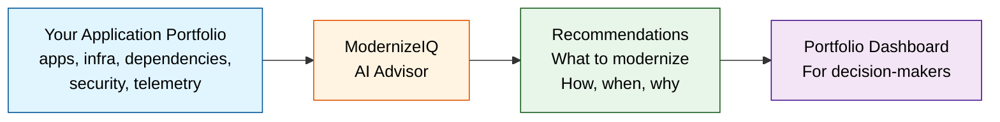
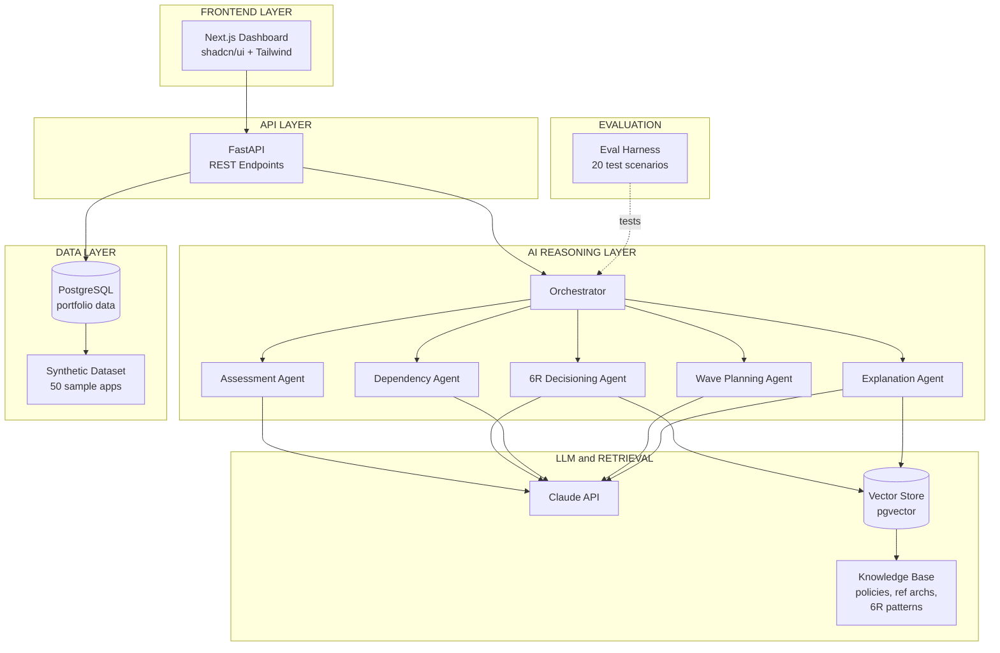
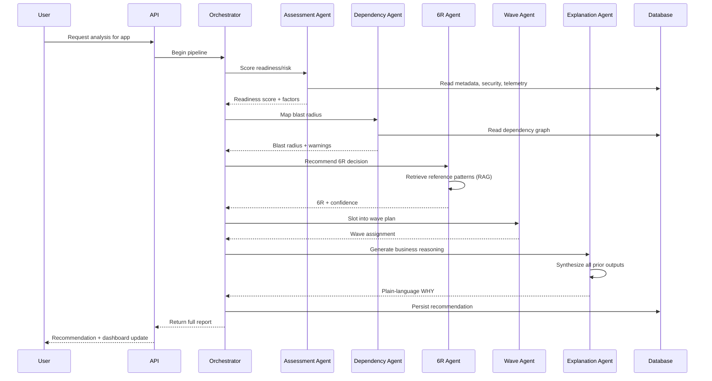
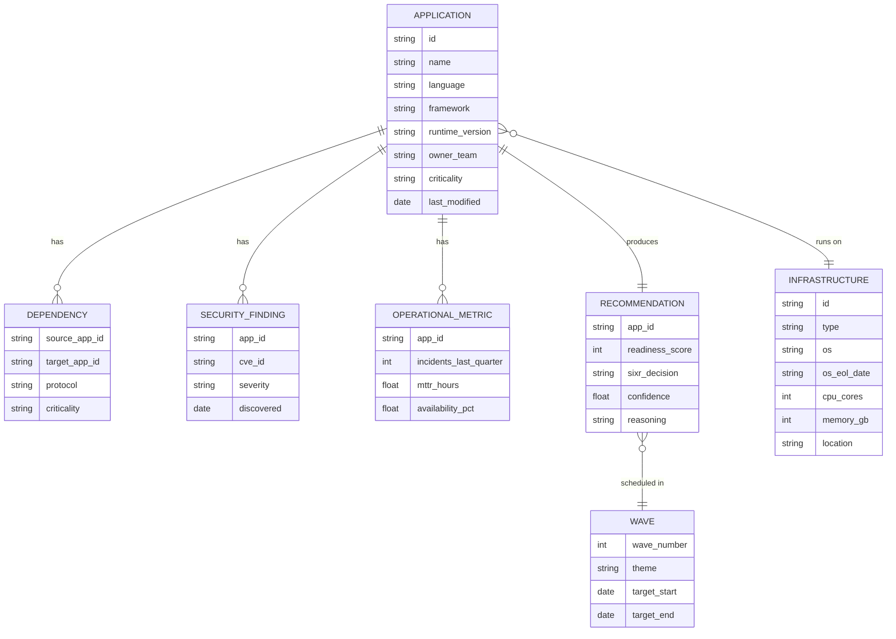

# ModernizeIQ

> An AI-powered advisor that helps enterprises decide **what to modernize, in what order, and why** — turning a multi-month consulting engagement into a guided, explainable, dashboard-driven decision.

---

## How to Read This README

- **If you're non-technical** (manager, recruiter, business stakeholder): read [The Problem](#the-problem), [What ModernizeIQ Does](#what-modernizeiq-does), and [The 6R Framework, Explained](#the-6r-framework-explained). Skip the rest unless curious.
- **If you're technical** (engineer, architect, hiring manager for an engineering role): read everything. Architecture, AI design, scope discipline, and evaluation are in the later sections.
- **Glossary** is at the bottom — every acronym used in this doc is defined there.

---

## The Problem

Most large companies are running on technology built 10–20 years ago. The applications still work, but the operating systems are unsupported, the hardware is failing, the security risks are growing, and the cost of keeping them alive is climbing. Eventually, every one of these systems has to be **modernized** — moved to the cloud, rewritten, replaced, or retired.

But making those decisions is brutally hard. A typical enterprise has 500–5,000 applications. For each one, somebody has to answer: *Is this still worth keeping? Should we move it as-is, redesign it, or throw it away? What does it depend on? What breaks if we touch it? When should we do this — and in what order with everything else?*

Today, this analysis is done by armies of consultants over months, costs millions, and produces static reports that are out of date the moment they're delivered. **ModernizeIQ replaces the analysis layer with an AI assistant that does it in minutes, explains its reasoning, and updates continuously.**

## What ModernizeIQ Does

ModernizeIQ takes in a portfolio of applications and the context around them — what they're built on, what they depend on, how they're performing, what security risks they carry — and produces, for each application:

- A **readiness and risk score** showing how urgent and how complex modernization will be
- A **6R recommendation** (Rehost, Replatform, Refactor, Retire, Replace, or Retain) with explainable reasoning
- A **wave plan** showing the ideal order in which the portfolio should be modernized
- An **executive dashboard** summarizing risk, cost savings, technical debt reduction, and progress

It's built on the principle that **AI recommendations are only useful if humans can understand and trust them**. Every output cites the evidence behind it.

---

## How It Works (At a Glance)

Synthetic portfolio data flows in. AI reasoning produces structured recommendations. The dashboard turns those recommendations into something a CIO can act on.

---

## Core Deliverables

### 1. Modernization Intelligence Advisor *(Option 1a from the brief)*

An AI assistant that ingests an application's metadata and produces a structured recommendation report. For each application, it outputs:

- **Modernization readiness score** (0–100) — security posture, obsolescence, complexity, operational risk
- **Target-state recommendation** — one of the 6R decisions, with confidence level
- **Dependency & compatibility warnings** — runtime, libraries, OS, database, middleware concerns
- **Wave-plan slot** — when this application should be modernized relative to others
- **Estimated benefits** — projected impact on cost, reliability, performance, security, delivery speed
- **Business-ready reasoning** — a plain-language explanation a CIO could quote in a board meeting

### 2. Modernization Portfolio Dashboard *(Option 1b from the brief)*

A live dashboard for executives and modernization leaders. It shows:

- **Status pipeline** — applications by stage: assessed → planned → in-flight → migrated → optimized
- **Top modernization candidates** — ranked by AI-derived risk, ROI, and urgency
- **Dependency clusters** — visualized "blast radius" for any proposed change
- **KPI tracking** — technical debt reduction index, projected cloud cost savings, platform adoption (containers, IaC, observability)
- **Executive scorecard** — progress by wave, value realized, risk retired

---

## Architecture

### System Overview

**Why this shape:**

- **Frontend, API, AI, Data are separated cleanly** so each can evolve independently. The dashboard team (you, with frontend rated 0.5) doesn't need to understand agent internals.
- **The Orchestrator owns the pipeline.** Individual agents don't talk to each other; the orchestrator coordinates. This keeps each agent simple and testable in isolation.
- **One database for both structured and vector data** (PostgreSQL + pgvector) avoids operational complexity. A second database is a second thing that can break.
- **The Evaluation Harness sits outside the runtime.** It's a separate test suite that runs on every change. This is the single most important component for a serious AI system.

### The AI Reasoning Pipeline

For a single application, the Advisor runs a sequenced multi-agent pipeline. Each agent has one job, can be tested in isolation, and contributes a piece of the final recommendation.

**Why a pipeline of small agents instead of one big prompt:**

A single mega-prompt that does everything is a black box. When it gives a wrong answer, you don't know which step failed. A pipeline of focused agents is engineering — each step has a contract, can be tested independently, and can be improved one piece at a time. This is the difference between a hackathon demo and a production-grade system.

### Data Model

The synthetic dataset captures everything an enterprise modernization team would feed into the system.

---

## The 6R Framework, Explained

The "6R" framework is the industry-standard set of decisions you can make about an old application. ModernizeIQ recommends one of these six for every app.

| Decision | What it means | When to choose |
|----------|---------------|----------------|
| **Rehost** | Move it to the cloud as-is ("lift and shift") | Low complexity, fast win, no time to redesign |
| **Replatform** | Move it with minor changes (e.g., managed DB instead of self-hosted) | Some optimization possible without rewriting |
| **Refactor** | Significantly redesign for the cloud (e.g., monolith → microservices) | Worth investing if the app is strategic |
| **Retire** | Shut it down — nobody really uses it anymore | Low usage, redundant capability, cost > value |
| **Replace** | Switch to an off-the-shelf modern alternative (SaaS/COTS) | The market has moved on; commercial alternatives exceed the in-house version |
| **Retain** | Leave it alone for now | Recently modernized, business windows, no clear ROI on changing it |

**Why this matters:** Choosing wrong is expensive. Rehosting an app that should have been retired wastes 6–12 months of engineering. Refactoring an app that should have been replaced wastes years. ModernizeIQ's job is to make this call defensibly, with evidence.

---

## Synthetic Dataset Design

Per the brief, ModernizeIQ uses **synthetic and public sample data only** — no real customer data.

The synthetic portfolio simulates a mid-size enterprise with **50 applications** across realistic profiles:

- **Legacy monoliths** running on EOL operating systems
- **Modern microservices** already on Kubernetes
- **Customer-facing apps** with high availability requirements
- **Internal tools** with low usage
- **Compliance-sensitive systems** (PCI, HIPAA-flavored, all synthetic)
- **Vendor COTS applications** approaching end-of-support

Each application has a complete metadata record, dependencies to 2–5 other apps, security findings (synthetic CVEs), and operational telemetry (synthetic incident counts, MTTR, availability). The dataset is generated programmatically and versioned in the repo so every recommendation can be reproduced.

---

## AI/ML Approach

### Multi-agent reasoning, not a single mega-prompt

Each step of the analysis is handled by a specialized agent with a focused prompt and a defined input/output contract. This makes the system testable, debuggable, and improvable one piece at a time.

### Retrieval-grounded recommendations

The 6R Decisioning Agent uses RAG over a curated knowledge base of:

- Reference architectures for common modernization patterns
- 6R decision rationales drawn from public case studies and vendor documentation
- Common gotchas, anti-patterns, and known pitfalls

This grounds recommendations in patterns that exist in the real world, not in what the LLM happens to remember.

### Explainability by design

Every recommendation includes:
- The evidence used (which data points drove the decision)
- The reference patterns retrieved (which prior cases informed it)
- A confidence level
- A plain-language explanation suitable for executive consumption

A recommendation without a reason is a guess. The Explanation Agent ensures no recommendation ships without one.

### Evaluation harness — the most important component

Twenty hand-crafted test scenarios cover the major decision archetypes (clear-rehost, clear-retire, ambiguous-refactor-vs-replace, dependency-blocked, compliance-deferred, and more). Every change to the system is run against this harness. The harness is the **definition of correct behavior** for ModernizeIQ — and the single biggest signal to a hiring manager that this is engineering, not vibes.

---

## Technology Stack

| Layer | Technology | Rationale |
|-------|------------|-----------|
| Frontend | Next.js, TypeScript, shadcn/ui, Tailwind | Fast to ship, good defaults, hireable skill set |
| API | FastAPI (Python) | Same language as the AI layer, async support, clean |
| AI Orchestration | LangGraph or custom state machine | Explicit pipeline control, debuggable |
| LLM | Claude (Anthropic) | Strong reasoning, large context, good tool use |
| Vector Store | PostgreSQL + pgvector | One database for both structured and embedding data |
| Database | PostgreSQL | Standard, well-understood, transactional |
| Visualization | Recharts (React) | Sufficient for dashboard charts |
| Evaluation | Custom harness, pytest | Lightweight, version-controlled |
| Deployment | Docker + Docker Compose (dev), TBD prod | Reproducible local environment |

---

## Scope

### In Scope (built properly)

- **Request Creation** — sources of modernization identification, automated request generation, AI auto-prioritization
- **Modernization Assessment** — readiness scoring, 6R decisioning with explainability, dependency & impact analysis
- **Tracking & Monitoring** — real-time dashboard, KPI tracking, risk heatmap, dependency cluster view
- **AI-Driven Capabilities** — predictive analytics on synthetic telemetry, NLP summarization, explainable 6R, dependency inference

### Partial (gestured at, not deeply built)

- **Modernization Rules & Policy Management** — 3–4 example governance policies encoded; not a full policy engine
- **Completion & Reporting** — sample executive scorecard and audit-log entries; not a full reporting suite

### Out of Scope (explicitly excluded)

- **Modernization Execution & Fulfilment** — IaC generation, containerization simulation, release orchestration
- **ITSM/ALM integration** — actual Jira/ServiceNow integration (we'll show what *would* be created)
- **Automated validation pipelines** — CI build, test simulation, security scanning

This split is deliberate. Trying to build everything in the brief at once produces a shallow product. Going deep on the **brain** (Advisor) and the **face** (Dashboard) is what makes this defensible as a portfolio piece.

---

## Roadmap

| Phase | Duration | Focus | Outcome |
|-------|----------|-------|---------|
| 0. Foundations | Month 1 | Synthetic data design, repo setup, eval harness skeleton | 50-app dataset, 20 test scenarios, CI pipeline |
| 1. The Brain | Month 2 | Assessment + 6R + Explanation agents | Working CLI: input app → output recommendation |
| 2. The Graph | Month 3 | Dependency analysis + wave planning | Multi-app analysis with sequencing |
| 3. The Face | Month 4 | Dashboard frontend | Portfolio view, app detail, executive scorecard |
| 4. The Polish | Month 5 | Write-ups, demo, system design doc | Blog post, architecture deep-dive, demo video |
| 5. Real Feedback | Month 6 | Ship to 5–10 design-partner reviewers | Iterated based on real feedback |

---

## Evaluation & Success Metrics

### For the AI

- **Recommendation accuracy** on the 20-scenario eval harness — target ≥85% match to expected 6R decision
- **Explanation quality** — human-rated 1–5 on clarity, completeness, defensibility — target ≥4.0 average
- **Confidence calibration** — high-confidence recommendations should be right more often than low-confidence ones

### For the Product

- **Time-to-recommendation** for a 50-app portfolio — target under 5 minutes
- **Dashboard load time** — target under 2 seconds for the portfolio view

### For the Engineer (you)

- **Project completion** — all six phases shipped
- **One genuinely novel technical contribution** — the eval harness, the dependency-inference approach, or the explanation framework
- **Three published artifacts** — technical blog post, architecture deep-dive, demo video

---

## Project Status

This README is the **specification** for ModernizeIQ. Sections marked "in scope" describe the intended end state, not what is currently built. Status of each phase will be updated here as work progresses.

**Current phase:** Phase 0 — Foundations

---

## Glossary

- **6R** — Industry-standard framework for application modernization decisions: Rehost, Replatform, Refactor, Retire, Replace, Retain.
- **Agent** — In this context, a focused AI component with one job (e.g., assess risk) and a defined input/output contract.
- **Blast radius** — How many other systems are affected if you change a given application.
- **CMDB** — Configuration Management Database. The system of record for an enterprise's IT assets.
- **COTS** — Commercial Off-The-Shelf software (vs. custom-built in-house).
- **CVE** — Common Vulnerabilities and Exposures. The standard catalog of publicly known security vulnerabilities.
- **EOL / EOS** — End-of-Life / End-of-Support. The date after which a vendor stops providing fixes and security patches.
- **IaC** — Infrastructure as Code. Defining infrastructure (servers, networks) in version-controlled code instead of clicking around in a UI.
- **ITSM / ALM** — IT Service Management / Application Lifecycle Management. The systems (e.g., ServiceNow, Jira) that track work and incidents.
- **LLM** — Large Language Model. The underlying AI model (Claude, GPT, etc.) doing the reasoning.
- **MTTR** — Mean Time To Recovery. Average time it takes to recover from an incident.
- **Multi-agent system** — A pipeline of specialized AI components working together rather than one giant prompt.
- **RAG** — Retrieval-Augmented Generation. The technique of looking up relevant information from a knowledge base and feeding it to the LLM as context.
- **Wave plan** — The sequenced order in which a portfolio of applications will be modernized.

---

## References

- The original problem brief (`Adobe_Scan_10_Apr_2026.pdf`)
- AWS / Azure / Google Cloud public migration playbooks (synthetic patterns)
- Public CNCF case studies for modernization examples
- *Designing Data-Intensive Applications* — Martin Kleppmann (system design grounding)

---

*ModernizeIQ — Built as a learning project and portfolio artifact. Synthetic data only. No real customer data is used or stored.*
